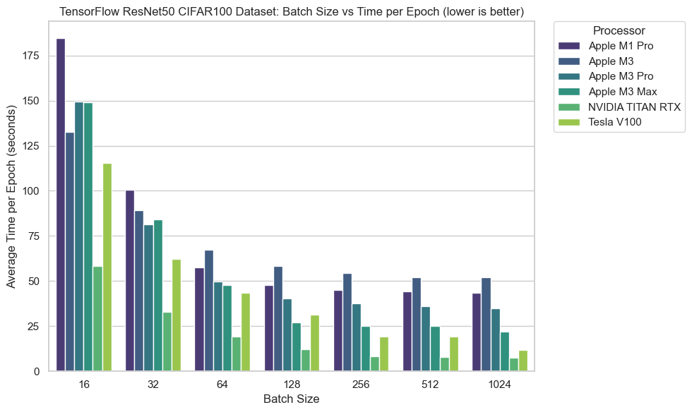
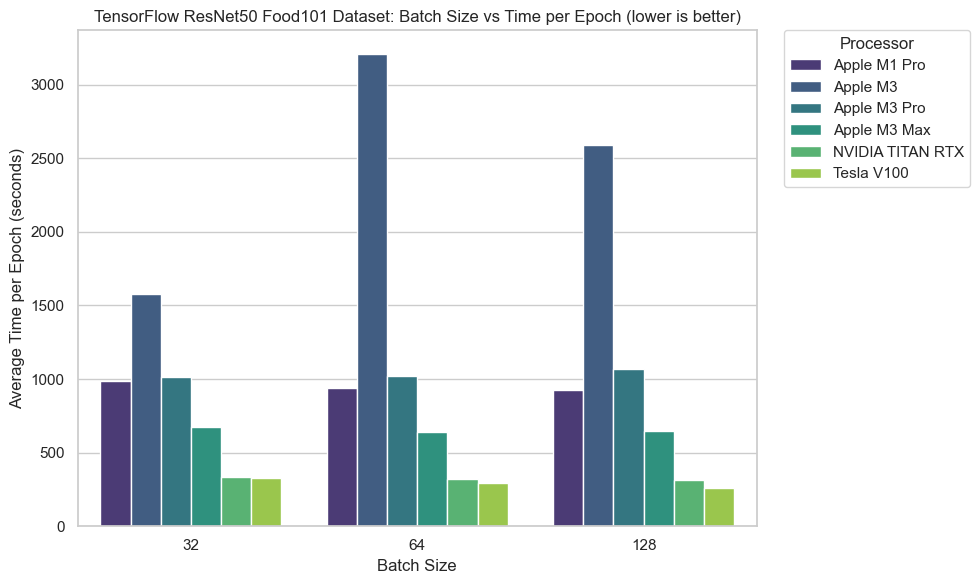
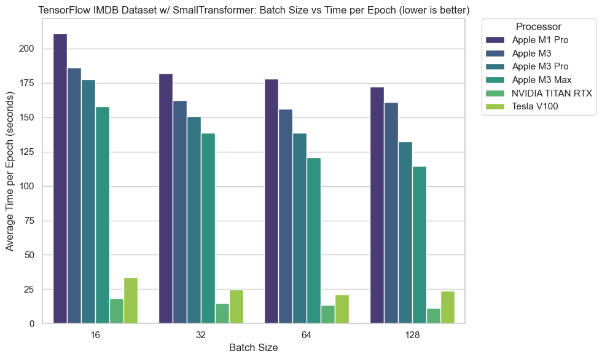
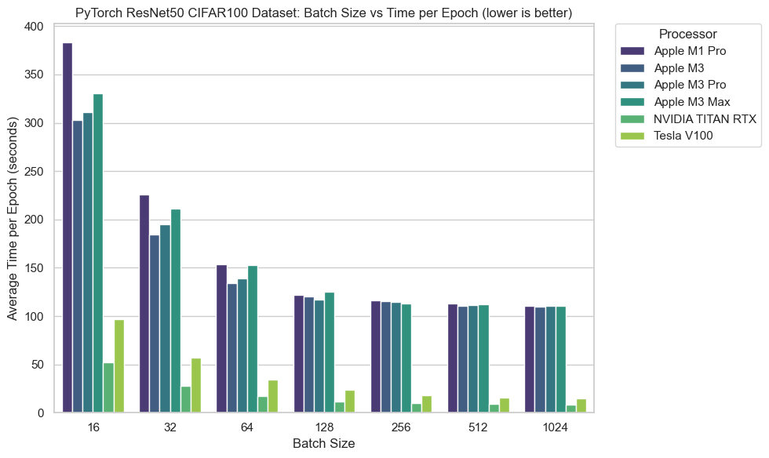
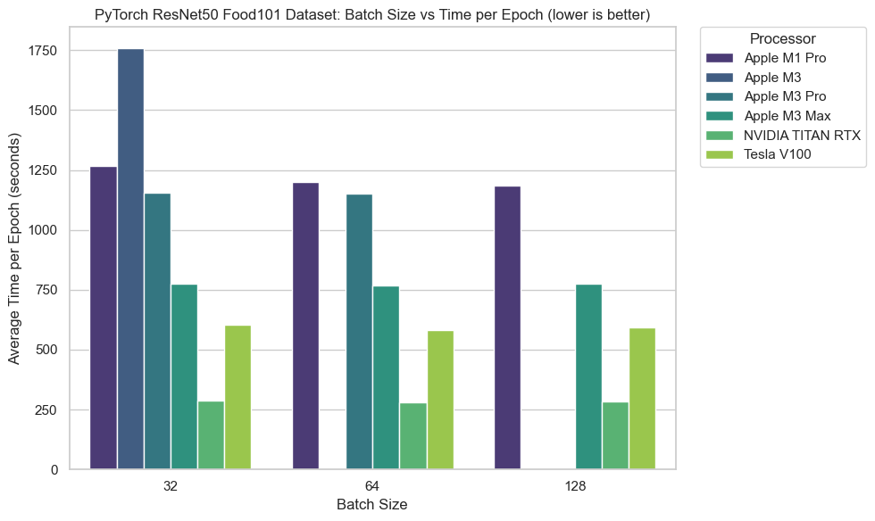
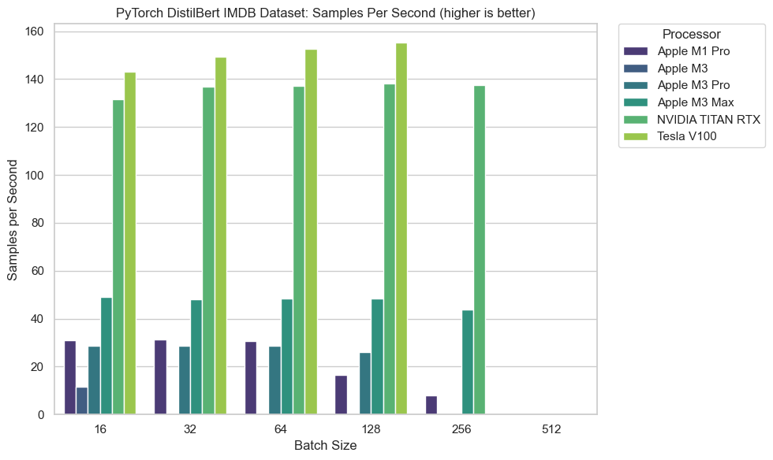
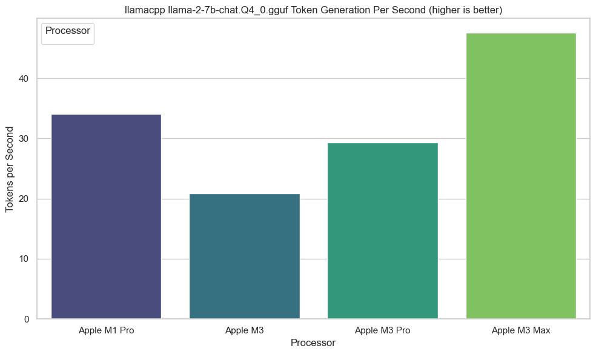

# Mac Machine Learning Speed Test (work in progress)

A collection of simple scripts focused on benchmarking the speed of various machine learning models on Apple Silicon Macs (M1, M2, M3).

Scripts should also ideally work with CUDA (for benchmarking on other machines/Google Colab).

> **Note:** Scripts are not designed to achieved state-of-the-art results (e.g. accuracy), they are designed to be as simple as possible to run out of the box. Most are examples straight from PyTorch/TensorFlow docs I've tweaked for specific focus on MPS (Metal Performance Shaders - Apple's GPU acceleration framework) devices + simple logging of timing. They are scrappy and likely not the best way to do things, but they are simple and easy to run.

## Experiment Overview

The focus of these experiments is to get a quick benchmark across various ML problems and see how the Apple Silicon Macs perform.

The focus is on hardware comparison rather than framework to framework comparison and measuring speed rather than accuracy.

This repo contains code for the following experiments:

* PyTorch Computer Vision (CIFAR100 image classification)
* PyTorch Computer Vision (Food101 image classification)
* PyTorch Natural Langua2ge Processing (NLP text classification)
* TensorFlow Computer Vision (CIFAR100 image classication)
* TensorFlow Computer Vision (Food101 image classification)
* TensorFlow Natural Language Processing (NLP text classification)
* LlamaCPP LLM test (text generation)

While the focus is on Apple Silicon Macs, I've included my own deep learning PC (NVIDIA TITAN RTX) as well as a Google Colab free tier instance for comparison.

## Getting Setup

If you have a brand new machine, you'll need to setup a few things before running the experiments.

The following steps will get you ready to go for all experiments (and many future machine learning experiments).

However, if you've already got `conda`, feel free to skip to the next section.

### Base environment setup 

1. Install homebrew (or run `xcode-select --install` in terminal and skip to next step)

Go to https://brew.sh/ and follow the main instructions on the front page.

Run the commands on the homebrew webpage in the terminal and follow the instructions when they appear.

2. Install miniforge to get conda: https://github.com/conda-forge/miniforge 

```
brew install miniforge
```

or

Download Miniforge3 for macOS ARM64 from: https://github.com/conda-forge/miniforge/releases/latest/download/Miniforge3-MacOSX-arm64.sh

3. Run the following commands in terminal with Miniforge3 downloaded into the `~/Downloads` folder:

```
chmod +x ~/Downloads/Miniforge3-MacOSX-arm64.sh
sh ~/Downloads/Miniforge3-MacOSX-arm64.sh
```

4. Follow the steps, for example, answer "yes", "yes", "ok" etc and then initialize conda to see if it works.

```
source ~/miniforge3/bin/activate
```

5. **Important:** Restart terminal and check conda is working.

If conda is working, you should have a `(base)` at the start of your terminal prompt.

For example: `(base) daniel@Daniels-MacBook-Pro-3 ~ %`

### Setting up for machine learning tests

1. Clone this repo.

```
git clone https://github.com/mrdbourke/mac-ml-speed-test.git 
```

2. Change into the repo directory.

```
cd mac-ml-speed-test
```

3. Create conda environment.

```python
conda create --prefix ./env python=3.10
```

**Note:** You could also use `conda create --name some-env-name python=3.10` but I prefer `--prefix` as it's more explicit.

4. Check conda environments.

```
conda env list
```

5. Activate newly created conda environment.

```
conda activate ./env
```

6. Install necessities/helper packages.

**Note:** This may have a few extra packages that aren't 100% needed for speed tests but help to have (e.g. JupyterLab, PrettyTable).

```python
conda install -c conda-forge pip pandas numpy matplotlib scikit-learn jupyterlab langchain prettytable py-cpuinfo tqdm
```

## Install and Test PyTorch/Hugging Face Transformers

* [Apple guide to installing PyTorch](https://developer.apple.com/metal/pytorch/). 
* [PyTorch guide to installing PyTorch](https://pytorch.org/get-started/locally/).
* Hugging Face Guides to Install [Transformers](https://huggingface.co/docs/transformers/installation), [Datasets](https://huggingface.co/docs/datasets/installation), [Evaluate](https://huggingface.co/docs/evaluate/installation), [Accelerate](https://huggingface.co/docs/accelerate/basic_tutorials/install).

```python
conda install pytorch::pytorch torchvision -c pytorch
```

> **Note:** MPS (Metal Performance Shaders, aka using the GPU on Apple Silicon) comes standard with PyTorch on macOS, you don't need to install anything extra. MPS can be accessed via [`torch.mps`](https://pytorch.org/docs/stable/mps.html), see more [notes in the PyTorch documentation](https://pytorch.org/docs/stable/notes/mps.html).

### Test PyTorch Computer Vision (CIFAR100)

Experiment details: 

| **Model** | **Dataset** | **Image Size** | **Epochs** | **Num Samples** | **Num Classes** | **Problem Type** |
| --- | --- | --- | --- | --- | --- | --- |
| [ResNet50](https://pytorch.org/vision/main/models/generated/torchvision.models.resnet50.html) | [CIFAR100](https://pytorch.org/vision/stable/generated/torchvision.datasets.CIFAR100.html) | 32x32x3 | 5 | 50,000 train, 10,000 test | 100 |  Image Classification |

Example usage of `pytorch_test_computer_vision_cifar100.py` for 1 epoch and batch size of 32:

```
python pytorch_test_computer_vision_cifar100.py --epochs=1 --batch_sizes="32"
```

Batch sizes can be a comma-separated list of batch sizes, e.g. `"32, 64, 128, 256"`.

Default behaviour is to test for `5` epochs and batch sizes of `"16, 32, 64, 128, 256, 512, 1024"`.

The following:

```
python pytorch_test_computer_vision_cifar100.py
```

Is equivalent to:

```
python pytorch_test_computer_vision_cifar100.py --epochs=5 --batch_sizes="16, 32, 64, 128, 256, 512, 1024"
```

Results will be saved to `results/results_pytorch_cv/[file_name].csv`  where `file_name` is a combination of information from the experiment (see `pytorch_test_computer_vision_cifar100.py` for details).

### Test PyTorch Computer Vision (Food101)

Experiment details:

| **Model** | **Dataset** | **Image Size** | **Epochs** | **Num Samples** | **Num Classes** | **Problem Type** |
| --- | --- | --- | --- | --- | --- | --- |
| [ResNet50](https://pytorch.org/vision/main/models/generated/torchvision.models.resnet50.html) | [Food101](https://huggingface.co/datasets/food101) | 224x224x3 | 5 | 75,750 train, 25,250 test | 101 | Image Classification |

**Note:** Download Hugging Face Datasets to download Food101 dataset.

```
python -m pip install datasets
```

Example usage of `pytorch_test_computer_vision_food101.py` for 1 epoch and batch size of 32:

```
python pytorch_test_computer_vision_food101.py --epochs=1 --batch_sizes="32"
```

Batch sizes can be a comma-separated list of batch sizes, e.g. `"32, 64, 128, 256"`.

Default behaviour is to test for `3` epochs and batch sizes of `"32, 64, 128"`.

The following:

```
python pytorch_test_computer_vision_food101.py
```

Is equivalent to:

```
python pytorch_test_computer_vision_food101.py --epochs=3 --batch_sizes="32, 64, 128"
```

Results will be saved to `results/results_pytorch_cv/[file_name].csv`  where `file_name` is a combination of information from the experiment (see `pytorch_test_computer_vision_food101.py` for details).


### Test PyTorch Natural Language Processing (NLP)

Experiment details:

| **Model** | **Dataset** | **Sequence Size** | **Epochs** | **Num Samples** | **Num Classes** | **Problem Type** |
| --- | --- | --- | --- | --- | --- | --- |
| [DistilBERT](https://huggingface.co/distilbert-base-uncased) (fine-tune top 2 layers + top Transformer block) | [IMDB](https://huggingface.co/datasets/imdb) | 512 | 5 | 25,000 train, 25,000 test | 2 | Text Classification |

> **Note:** The `pytorch_test_nlp.py` uses Hugging Face Transformers/Datasets/Evaluate/Accelerate to help with testing. If you get into ML, you'll likely come across these libraries, they are very useful for NLP and ML in general. The model loaded from Transformers uses PyTorch as a backend.

```python
python -m pip install transformers datasets evaluate accelerate
```

Example usage of `pytorch_test_nlp.py` for 1 epoch and batch size of 32:

```
python pytorch_test_nlp.py --epochs=1 --batch_sizes="32"
```

Batch sizes can be a comma-separated list of batch sizes, e.g. `"32, 64, 128, 256"`.

Default behaviour is to test for `3` epochs and batch sizes of `"16, 32, 64, 128, 256, 512"` (**note:** without 24GB+ of RAM, running batch sizes of 256+ will likely error, for example my M1 Pro with 18GB of VRAM can only run `"16, 32, 64, 128"` and fails on `256` with the model/data setup in `python_test_nlp.py`).

The following:

```
python pytorch_test_nlp.py
```

Is equivalent to:

```
python pytorch_test_nlp.py --epochs=3 --batch_sizes="16, 32, 64, 128, 256, 512"
```

Results will be saved to `results/results_pytorch_nlp/[file_name].csv` where `file_name` is a combination of information from the experiment (see `pytorch_test_nlp.py` for details).

## Install and Test TensorFlow

For more on running TensorFlow on macOS, see [Apple's developer guide](https://developer.apple.com/metal/tensorflow-plugin/). 

**Note:** Install TensorFlow Datasets to access Food101 dataset with TensorFlow.

```python
python -m pip install tensorflow
python -m pip install tensorflow-metal  
python -m pip install tensorflow_datasets
```

> **Note:** TensorFlow can be run on macOS *without* using the GPU via `pip install tensorflow`, however, if you're using an Apple Silicon Mac, you'll want to use the Metal plugin for GPU acceleration (`pip install tensorflow-metal`).
> 
> After installing `tensorflow-metal` and running the scripts, you should see something like: 
>
> `2023-12-06 12:22:02.016745: I tensorflow/core/grappler/optimizers/custom_graph_optimizer_registry.cc:117] Plugin optimizer for device_type GPU is enabled.`

### Test TensorFlow Computer Vision (CIFAR100)

Experiment details:

| **Model** | **Dataset** | **Image Size** | **Epochs** | **Num Samples** | **Num Classes** | **Problem Type** |
| --- | --- | --- | --- | --- | --- | --- |
| [ResNet50](https://www.tensorflow.org/api_docs/python/tf/keras/applications/resnet50/ResNet50) | [CIFAR100](https://www.tensorflow.org/datasets/catalog/cifar100) | 32x32x3 | 5 | 50,000 train, 10,000 test | 100 | Image Classification |

Example usage of `tensorflow_test_computer_vision_cifar100.py` for 1 epoch and batch size of 32:

```
python tensorflow_test_computer_vision_cifar100.py --epochs=1 --batch_sizes="32"
```

Batch sizes can be a comma-separated list of batch sizes, e.g. `"32, 64, 128, 256"`.

Default behaviour is to test for `5` epochs and batch sizes of `"16, 32, 64, 128, 256, 512, 1024"`.

The following:

```
python tensorflow_test_computer_vision_cifar100.py
```

Is equivalent to:

```
python tensorflow_test_computer_vision_cifar100.py --epochs=5 --batch_sizes="16, 32, 64, 128, 256, 512, 1024"
```

Results will be saved to `results/results_tensorflow_cv/[file_name].csv`  where `file_name` is a combination of information from the experiment (see `tensorflow_test_computer_vision_cifar100.py` for details). 

### Test TensorFlow Computer Vision (Food101)

Experiment details:

| **Model** | **Dataset** | **Image Size** | **Epochs** | **Num Samples** | **Num Classes** | **Problem Type** |
| --- | --- | --- | --- | --- | --- | --- |
| [ResNet50](https://www.tensorflow.org/api_docs/python/tf/keras/applications/resnet50/ResNet50) | [Food101](https://www.tensorflow.org/datasets/catalog/food101) | 224x224x3 | 5 | 75,750 train, 25,250 test | 101 | Image Classification |

Example usage of `tensorflow_test_computer_vision_food101.py` for 1 epoch and batch size of 32:

```
python tensorflow_test_computer_vision_food101.py --epochs=1 --batch_sizes="32"
```

Batch sizes can be a comma-separated list of batch sizes, e.g. `"32, 64, 128"`.

Default behaviour is to test for `3` epochs and batch sizes of `"32, 64, 128"`.

The following:

```
python tensorflow_test_computer_vision_food101.py
```

Is equivalent to:

```
python tensorflow_test_computer_vision_food101.py --epochs=3 --batch_sizes="32, 64, 128"
```

Results will be saved to `results/results_tensorflow_cv/[file_name].csv`  where `file_name` is a combination of information from the experiment (see `tensorflow_test_computer_vision_food101.py` for details).

### Test TensorFlow Natural Language Processing (NLP)

Experiment details:

| **Model** | **Dataset** | **Sequence Size** | **Epochs** | **Num Samples** | **Num Classes** | **Problem Type** |
| --- | --- | --- | --- | --- | --- | --- |
| SmallTransformer (custom) | [IMDB](https://www.tensorflow.org/api_docs/python/tf/keras/datasets/imdb) | 200 | 5 | 25,000 train, 25,000 test | 2 | Text Classification |

Example usage of `tensorflow_test_nlp.py` for 1 epoch and batch size of 32:

```
python tensorflow_test_nlp.py --epochs=1 --batch_sizes="32"
```

Batch sizes can be a comma-separated list of batch sizes, e.g. `"32, 64, 128, 256"`.

Default behaviour is to test for `3` epochs and batch sizes of `"16, 32, 64, 128"`.

The following:

```
python tensorflow_test_nlp.py
```

Is equivalent to:

```
python tensorflow_test_nlp.py --epochs=3 --batch_sizes="16, 32, 64, 128"
```

Results will be saved to `results/results_tensorflow_nlp/[file_name].csv` where `file_name` is a combination of information from the experiment (see `tensorflow_test_nlp.py` for details).

## Install and Test LlamaCPP (Llama 2 LLM test)

Experiment details:

| **Model** | **Task** | **Num Questions** | **Num Answers** | **Total Generations** |
| --- | --- | --- | --- | --- | 
| [Llama 2 7B .gguf format](https://huggingface.co/TheBloke/Llama-2-7B-Chat-GGUF/blob/main/llama-2-7b-chat.Q4_0.gguf) | Text Generation | 20 | 5 | 20*5 = 100 | 

* See: https://llama-cpp-python.readthedocs.io/en/latest/install/macos/ (note: this focuses on macOS install, I haven't tested with CUDA)

```python
CMAKE_ARGS="-DLLAMA_METAL=on" FORCE_CMAKE=1 python -m pip install llama-cpp-python
```

After installing `llama-cpp-python`, you will need a `.gguf` format model from Hugging Face.

- Download a model from Hugging Face with `.gguf` extension, e.g. [`https://huggingface.co/TheBloke/Llama-2-7B-Chat-GGUF/blob/main/llama-2-7b-chat.Q4_0.gguf`](https://huggingface.co/TheBloke/Llama-2-7B-Chat-GGUF/blob/main/llama-2-7b-chat.Q4_0.gguf) → `llama-2-7b-chat.Q4_0.gguf`
    - Download link: https://huggingface.co/TheBloke/Llama-2-7B-Chat-GGUF/resolve/main/llama-2-7b-chat.Q4_0.gguf?download=true
    - Download code:

* Install wget if necessary, requires homebrew: https://brew.sh/

```python
brew install wget 
```

* Download a `.gguf` LLM file from Hugging Face, on [TheBloke profile](https://huggingface.co/TheBloke), usage/results will vary depending on which model you use, choosing `llama-2-7b-chat.Q4_0.gguf` as an example:

```
wget https://huggingface.co/TheBloke/Llama-2-7b-Chat-GGUF/resolve/main/llama-2-7b-chat.Q4_0.gguf
```
Once you've downloaded your model file, put it in the same directory as `llama2_test.py` (or update the `model_path` argument to point to the file).

Example usage of `llama2_test.py` to generate an answer to 1 example question 1 time using the `llama-2-7b-chat.Q4_0.gguf` model:

```
python llama2_test.py --path_to_gguf_model="llama-2-7b-chat.Q4_0.gguf" --num_questions=1 --num_times_per_question=1
```

Default behaviour is to generate an answer to `20` example questions `5` times each using the `llama-2-7b-chat.Q4_0.gguf` model (100 total generations).

The following:

```
python llama2_test.py
```

Is equivalent to:

```
python llama2_test.py --path_to_gguf_model="llama-2-7b-chat.Q4_0.gguf" --num_questions="all" --num_times_per_question=5
```

Results will be saved to `results/results_llama2/[file_name].csv` where `file_name` is a combination of information from the experiment (see `llama2_test.py` for details).

* Note on LLM files: you can use other .gguf models, e.g. llama-2-13b, 70b, other variants etc, I just went with 7b to demonstrate (as to run 70b, you will need a lot of RAM, ~70GB+ in half precision, [~40GB in Quantize 4 precision](https://huggingface.co/TheBloke/Llama-2-70B-Chat-GGUF/tree/main)) 

## Results

The following are the machines I tested. For all of the M3 variants of the MacBook Pro's, they were the base model in their class (e.g. an M3 Pro MacBook Pro with no upgrades from the Apple Store).

| **Machine** | **CPU** | **GPU** | **RAM** | **Storage** | **Price (USD)** |
| --- | --- | --- | --- | --- | --- |
| M1 Pro 14" 2021 | 10-core CPU | 16-core GPU | 32GB | 4TB SSD | ~$3,500 | 
| M3 14" 2023 | 8-core CPU | 10-core GPU | 8GB | 512GB SSD | $1,599 |
| M3 Pro 14" 2023 | 11-core CPU | 14-core GPU | 18GB | 512GB SSD | $1,999 |
| M3 Max 14" 2023 | 14-core CPU | 30-core GPU | 36GB | 1TB SSD | $3,199 |
| Deep Learning PC | Intel i9 | NVIDIA TITAN RTX (24GB) | 32GB | 1TB SSD | ~$3,000 |
| Google Colab Free Tier | 2-core CPU | NVIDIA Tesla V100 (16GB) | 12GB | 100GB SSD | Free or $10/month for more compute |

Notes: 

* Only training time was measured as this generally takes far more time than inference (except for Llama 2 text generation, this was inference only). 
* If a result isn't present for a particular machine, it means it either failed or didn't have enough memory to complete the test (e.g. M3 Pro 14" 2023 with 8GB RAM couldn't run batch size 64 for PyTorch CV Food101).

### TensorFlow Computer Vision (CIFAR100)



### TensorFlow Computer Vision (Food101)



### TensorFlow Natural Language Processing (NLP)



### PyTorch Computer Vision (CIFAR100)



### PyTorch Computer Vision (Food101)



### PyTorch Natural Language Processing (NLP)



### Llama 2 (LLM)



### Geekbench ML

All tests done using [Geekbench ML 0.6.0](https://www.geekbench.com/ml/) for Mac.

Tests include a series of [inference-only benchmarks](https://www.geekbench.com/doc/ml-0.6-inference-workloads.pdf) across different domains.

| Machine                        | Num CPU cores | CPU  | CPU-link                                                     | Num GPU Cores | GPU  | GPU-link                                                     | Neural Engine | Neural Engine-link                                             |
|--------------------------------|---------------|------|--------------------------------------------------------------|---------------|------|--------------------------------------------------------------|---------------|---------------------------------------------------------------|
| MacBook Pro M1 Pro 14 inch, 2021| 10            | 1809 | [Link](https://browser.geekbench.com/ml/v0/inference/330843) | 16            | 5192 | [Link](https://browser.geekbench.com/ml/v0/inference/330844) | 6462          | [Link](https://browser.geekbench.com/ml/v0/inference/330846) |
| MacBook Pro M3 14 inch, 2023   | 8             | 2356 | [Link](https://browser.geekbench.com/ml/v0/inference/330849) | 10            | 5747 | [Link](https://browser.geekbench.com/ml/v0/inference/330850) | 8399          | [Link](https://browser.geekbench.com/ml/v0/inference/330853) |
| MacBook Pro M3 Pro 14 inch, 2023| 11            | 2355 | [Link](https://browser.geekbench.com/ml/v0/inference/330860) | 14            | 7030 | [Link](https://browser.geekbench.com/ml/v0/inference/330861) | 10237         | [Link](https://browser.geekbench.com/ml/v0/inference/330859) |
| MacBook Pro M3 Max 14 inch, 2023| 14            | 2393 | [Link](https://browser.geekbench.com/ml/v0/inference/330866) | 30            | 9008 | [Link](https://browser.geekbench.com/ml/v0/inference/330869) | 9260          | [Link](https://browser.geekbench.com/ml/v0/inference/330901) |


## Discussion

It's quite clear that the newest M3 Macs are quite capable of machine learning tasks.

However, dedicated NVIDIA GPUs still have a clear lead.

The results also show that more GPU cores and more RAM equates to better performance (e.g. M3 Max outperforming most other Macs on *most* batch sizes).

An interesting result was that the M3 base chip outperformed (or performed level with) the M3 Pro and M3 Max on smaller-scale experiments (CIFAR100, smaller batch sizes).

I'm not 100% sure why this is the case but my intuition tells me this is likely because the overhead of copying data to and from the GPU is more expensive than the actual training itself (e.g. the GPU is waiting for data to be copied to it, rather than being fully utilized).

So in practice, the M3 can compete with M3 Pro and M3 Max because the actual computation doesn't take long but the copying does.

Either way, the Food101 examples show a more realistic example with larger image sizes. It's here that the machines with more GPU cores perform faster and the machines with more RAM can handle larger batch sizes.

For the best results, you'll want to always pack as much data into the GPU as possible (to utilize all of your GPU cores) and avoid copying data between memory.

I thought that the unified memory system on the M-series chips would reduce copying overheads. Perhaps this is not yet the case from a software perspective (e.g. PyTorch and TensorFlow are not designed for Apple Silicon).

Maybe newer frameworks designed for Apple Silicon such as [MLX](https://github.com/ml-explore/mlx) will better utilize the unified memory system. This will require further investigation. 

The Geekbench ML results were as expected (newer and bigger chips doing better) with the exception of the M3 Max performing slightly worse on the Neural Engine than the M3 Pro. However, I'd take this number with a grain of salt as it will likely be close to unnoticed in real-world applications. 

## Recommendations

For smaller experiments, fine-tuning models and learning the fundamentals of machine learning, the M3 Macs will be more than fine to use.

But for larger scale workloads, you'll likely still want a dedicated NVIDIA GPU.

Personally, I use my M1 MacBook Pro as a daily driver but perform all larger-scale deep learning experiments on my NVIDIA GPU PC (connected via SSH). For example, I do plenty of data exploration for [Nutrify](https://nutrify.app/) (an app my brother I have built to help people learn about food) but all model training happens on a NVIDIA Titan RTX.

And Google Colab helps to fill in the gaps whenever necessary.

Based on the results across the new M3 Macs, I'm not personally going to upgrade my M1 MacBook Pro.

But I am curious to see how a spec'd up M3 Max (or future M3 Ultra) would go with a dedicated MLX model against my NVIDIA GPU PC.

In summary my recommendations are:

* Go for as much RAM and GPU cores as you can afford, typically in that order.
    * More GPU cores = faster training/inference.
    * More RAM = larger batch sizes/models.
* Avoid the 8GB RAM M3, 16GB is a good minimum.
    * As value for money, the M3 Pro with a RAM upgrade (16GB -> 36GB) and GPU upgrade (14-cores -> 18 cores) still comes in cheaper than an M3 Max.
* If you've got the option, perhaps spend less on a MacBook and buy a dedicated NVIDIA GPU and setup a deep learning PC you can SSH into (this is what I do).
    * For example, get the baseline M3 with a RAM upgrade and spend the rest of the money on a NVIDIA GPU. 

## Notes

* Big big big: found you need to increase `ulimit -n` on M3 Pro and M3 Max to run larger experiments (e.g. default on M3 Pro, M3 Max is `ulimit -n 256`, I increased to `ulimit -n 2560` (10x increase, which is the default on the base M3 and my M1 Pro) and was able to run larger experiments, e.g. batch size 64+ for computer vision)
    * If you get the error `OSError: [Errno 24] Too many open files...` (or something similar), try increasing `ulimit -n`
* As far as I know, float16 (mixed-precision training) doesn't work on MPS devices, this is why I've used float32 for all tests, float16 will typically halve training times on compatible devices (e.g. NVIDIA GPUs).
* Also, MPS doesn't support `torch.compile()` which also speeds up training times on NVIDIA Ampere GPUs & above.
* Tests should not be compared between frameworks, e.g. TensorFlow vs PyTorch for X task. They are more designed to compare the same code across hardware. 

## Potential upgrades

* Add total memory count + num GPU cores to results e.g. "Apple_M1_Pro_18GB_Memory_14_GPU_Cores..."
* Add scikit-learn/XGBoost tests, e.g. 100,000 rows, 1,000,000 rows?
* Could I use Keras 3.0 for the same code to run on multiple backends? :thinking:
* Apple has recently released a deep learning framework called [`MLX`](https://github.com/ml-explore/mlx) which is designed for Apple Silicon, this may significantly improve speed on Apple Silicon Macs, see the `mlx/` directory for more. See this example of Llama 2 running on MLX - https://huggingface.co/mlx-llama/Llama-2-7b-chat-mlx 